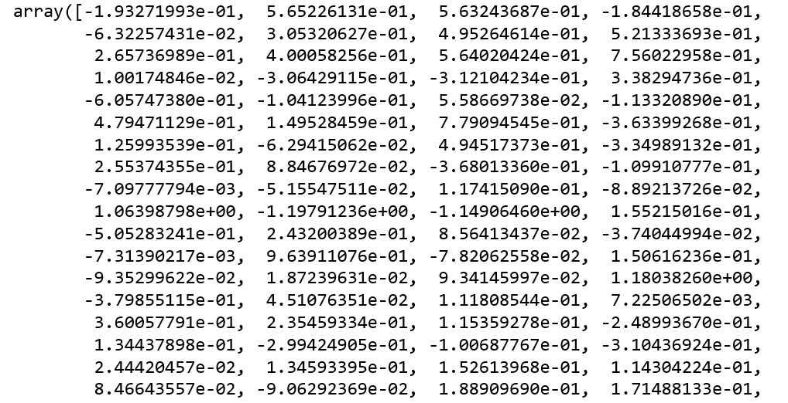
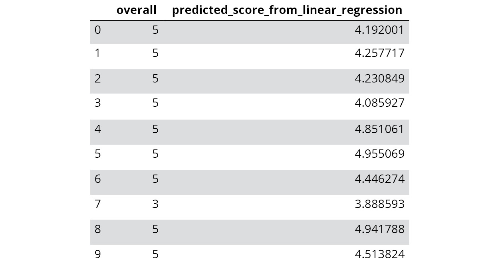
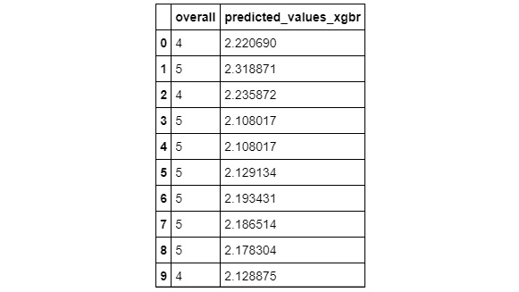
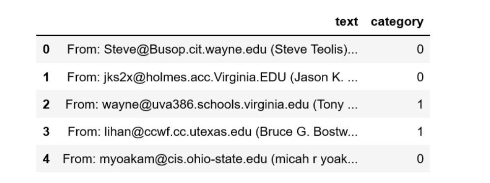
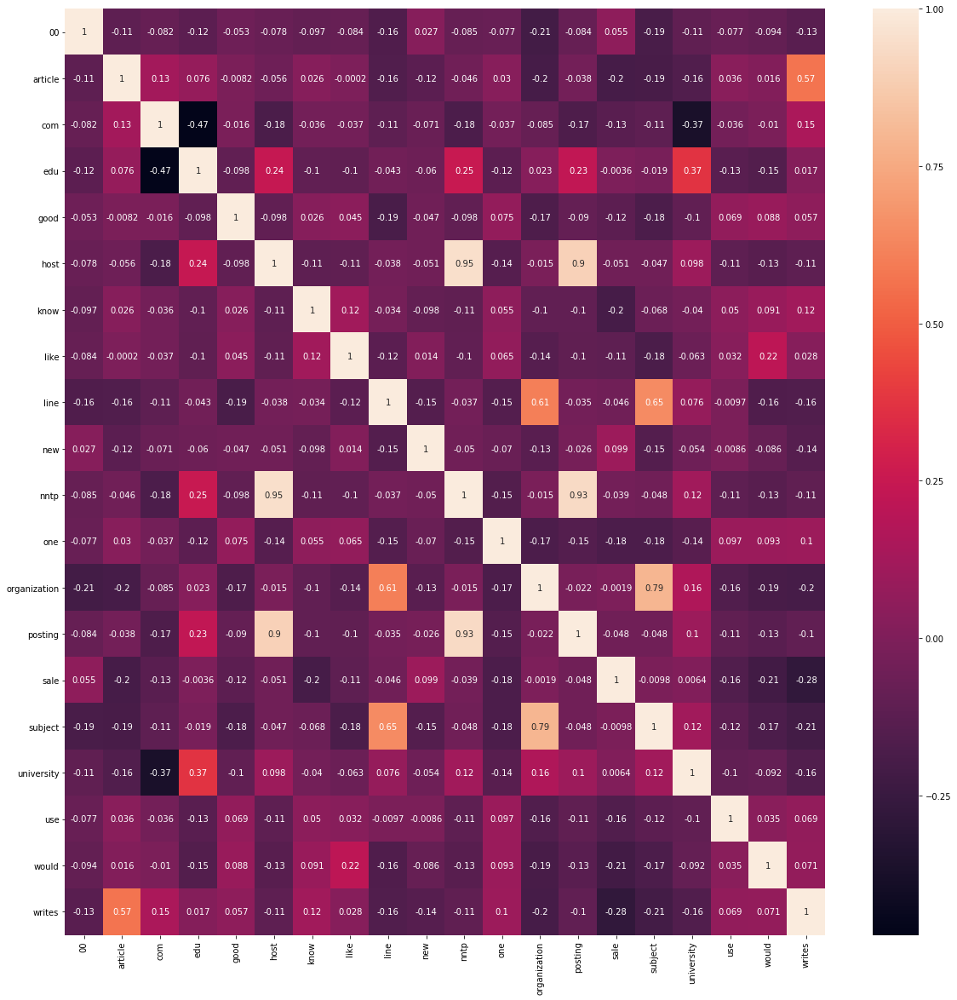
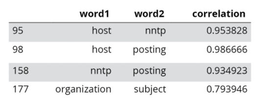
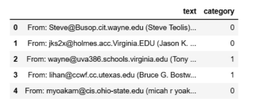
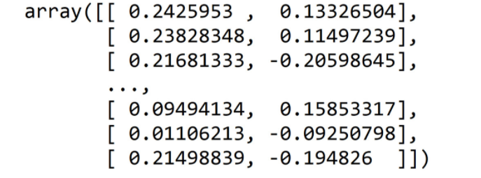
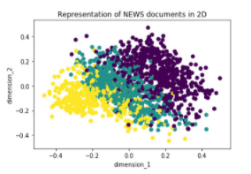
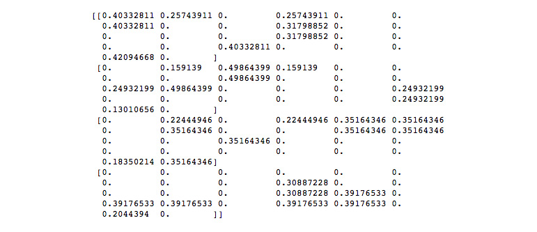

Lab 3. Developing a Text classifier
===============================

Learning Objectives
-------------------

By the end of this lab, you will be able to:

-   Describe the different types of machine learning algorithms
-   Differentiate between unsupervised and supervised learning
    methodologies
-   Distinguish between classification and regression problems
-   Describe various sampling techniques
-   Develop end-to-end text classifiers
-   Evaluate models using metrics such as accuracy, precision, and
    recall
-   Build pipelines for streamlining NLP projects
-   Save and load models

In this lab, you will learn about the various types of machine
learning algorithms and develop classifiers with their help.

#### Pre-reqs:
- Google Chrome (Recommended)

#### Lab Environment
Notebooks are ready to run. All packages have been installed. There is no requirement for any setup.

All examples are present in `~/work/nlp-fundamentals/Lesson3` folder. 

You can access lab at `http://<host-ip>/lab/workspaces/lab3_Classifier`

Hierarchical Clustering
-----------------------

In this algorithm, we can vary the number of clusters as per our
requirement. First, we construct a matrix consisting of distances
between each pair of instances (data points). After that, we follow
either of two approaches: **Agglomerative** (bottom-up) or **Divisive**
(top-down) to construct a **dendrogram**. A dendrogram is a
representation of clusters in the form of a tree based on the distances
between them. We truncate the tree at a location corresponding to the
number of clusters we need.


Exercise 29: Hierarchical Clustering
------------------------------------

In this exercise, we will create four clusters from text documents of
sklearn\'s \"fetch\_20 newsgroups\" dataset. We will make use of
hierarchical clustering. Once the clusters are created, we will compare
them with their actual categories. Follow these steps to implement this
exercise:

1.  Open a Jupyter notebook.

2.  Insert a new cell and add the following code to import the necessary
    libraries:


    ```
    from sklearn.datasets import fetch_20newsgroups
    from scipy.cluster.hierarchy import ward, dendrogram
    import matplotlib as mpl
    from scipy.cluster.hierarchy import fcluster
    from sklearn.metrics.pairwise import cosine_similarity
    import pandas as pd
    import numpy as np
    import matplotlib.pyplot as plt
    %matplotlib inline
    import re
    import string
    from nltk import word_tokenize
    from nltk.corpus import stopwords
    from nltk.stem import WordNetLemmatizer
    from sklearn.feature_extraction.text import TfidfVectorizer
    from collections import Counter
    from pylab import *
    import nltk
    import warnings
    warnings.filterwarnings('ignore')
    ```


3.  Now, we will download a list of stop words and the
    `Wordnet` corpus from `nltk`. Insert a new cell
    and add the following code to implement this:


    ```
    nltk.download('stopwords')
    stop_words=stopwords.words('english')
    stop_words=stop_words+list(string.printable)
    nltk.download('wordnet')
    lemmatizer=WordNetLemmatizer()
    ```


4.  Now, we\'ll specify the categories of news articles we want to fetch
    by. Add the following code to do this:


    ```
    categories= ['misc.forsale', 'sci.electronics', 'talk.religion.misc']
    ```


5.  To fetch the dataset, we use the following lines of code:


    ```
    news_data = fetch_20newsgroups(subset='train', categories=categories,shuffle=True, random_state=42, download_if_missing=True)
    ```


6.  To view the data of the fetched content, add the following code:

    ```
    news_data['data'][:5]
    ```


    The preceding code generates the following output:

    


7.  To check the categories of news articles, insert a new cell and add
    the following code:

    ```
    news_data.target
    ```


    The preceding code generates the following output:

    


    Here, **0** refers to \'`misc.forsale`\', **1** refers to
    \'`sci.electronics`\', and **2** refers to category
    \'`talk.religion.misc`\'.

8.  To check the categories we are dealing with, add the following code:

    ```
    news_data.target_names
    ```


    The preceding code generates the following output:

    


9.  To store `news_data` and the corresponding categories in a
    pandas DataFrame and view it, we write the following code:

    ```
    news_data_df = pd.DataFrame({'text' : news_data['data'], 'category': news_data.target})
    news_data_df.head()
    ```


    The preceding code generates the following output:

    


10. To count the number of occurrences of each category appearing in
    this dataset, we write the following code:

    ```
    news_data_df['category'].value_counts()
    ```


    The preceding code generates the following output:

    


11. In the next step, we will use a lambda function to extract tokens
    from each \'text\' of the `news_data_df` DataFrame, check
    whether any of these tokens are stop words, lemmatize them, and
    concatenate them side by side. We make use of the `join`
    function to concatenate a list of words into a single sentence. We
    use the regular expression (`re`) to replace anything
    other than alphabets, digits, and white spaces with blank space. Add
    the following code to do this:


    ```
    news_data_df['cleaned_text'] = news_data_df['text'].apply(\
    lambda x : ' '.join([lemmatizer.lemmatize(word.lower()) \
        for word in word_tokenize(re.sub(r'([^\s\w]|_)+', ' ', str(x))) if word.lower() not in stop_words]))
    ```


12. Now, we\'ll create a `tf-idf` matrix and transform it to a
    DataFrame. Add the following code to do this:

    ```
    tfidf_model = TfidfVectorizer(max_features=200)
    tfidf_df = pd.DataFrame(tfidf_model.fit_transform(news_data_df['cleaned_text']).todense())
    tfidf_df.columns = sorted(tfidf_model.vocabulary_)
    tfidf_df.head()
    ```


    The preceding code generates the following output:

    


13. In this step, we\'ll create a distance matrix by subtracting the
    cosine similarities of the `tf-idf` representation of
    documents from number 1. The `ward` function is used to
    create a linkage matrix, used in hierarchical clustering. Add the
    following code to do this:


    ```
    dist = 1 - cosine_similarity(tfidf_df)
    linkage_matrix = ward(dist)
    ```


14. Now, we\'ll truncate the `dendrogram` to keep the last
    four clusters. The leaves of a `dendrogram` refer to the
    individual instances that are data points. `leaf_rotation`
    denotes the angle by which leaf levels must be rotated.
    `leaf_font_size` denotes the font size of leaf labels. Add
    the following code to implement this:

    ```
    #Truncating the Dendogram Truncation to show last 4 clusters
    plt.title('Hierarchical Clustering using truncated Dendrogram')
    plt.xlabel('clustered documents')
    plt.ylabel('distance')
    dendrogram(
        linkage_matrix,
        truncate_mode='lastp',  # showing only last p clusters after merging
        p=4,  # p is the number of cluster that should remain after merging 
        leaf_rotation=90.,
        leaf_font_size=12.
        )
    plt.show()
    ```


    The preceding code generates the following output:

    


15. Now, we\'ll use the `fcluster()` function to obtain
    cluster labels of clusters obtained by hierarchical clustering:

    ```
    k=4
    clusters = fcluster(linkage_matrix, k, criterion='maxclust')
    clusters
    ```


    The preceding code generates the following output:

    


16. Finally, we make use of the `crosstab` function of pandas
    to compare the clusters we have obtained with the actual categories
    of news articles. Add the following code to implement this:

    ```
    news_data_df['obtained_clusters'] = clusters
    pd.crosstab(news_data_df['category'].replace({0:'misc.forsale', 1:'sci.electronics', 2:'talk.religion.misc'}),\
                news_data_df['obtained_clusters'].\
                replace({1 : 'cluster_1', 2 : 'cluster_2', 3 : 'cluster_3', 4: 'cluster_4'}))
    ```


    The preceding code generates the following output:


K-Means Clustering
------------------

In this algorithm, we segregate the given instances (data points) into k
groups (here, k is a natural number). Firstly, we choose k centroids. We
assign each instance to its nearest centroid, thereby creating k groups.
This is the assignment phase. It is followed by the update phase.

In the next section, we will solve an exercise to get a better
understanding of k-means clustering.

Exercise 30: K-Means Clustering
-------------------------------

In this exercise, we will create four clusters from text documents in
sklearn\'s \"fetch\_20 newsgroups\" text dataset using k-means
clustering. We will compare these clusters with the actual categories
and use the elbow method to obtain the optimal number of clusters.
Follow these steps to implement this exercise:

1.  Open a Jupyter notebook.

2.  Insert a new cell and add the following code to import the necessary
    packages:


    ```
    import pandas as pd
    from sklearn.datasets import fetch_20newsgroups
    import matplotlib.pyplot as plt
    %matplotlib inline
    import re
    import string
    from nltk import word_tokenize
    from nltk.corpus import stopwords
    from nltk.stem import WordNetLemmatizer
    from sklearn.feature_extraction.text import TfidfVectorizer
    from collections import Counter
    from pylab import *
    import nltk
    import warnings
    warnings.filterwarnings('ignore')
    import seaborn as sns; 
    sns.set()
    import numpy as np
    from scipy.spatial.distance import cdist
    from sklearn.cluster import KMeans
    ```


3.  We will be using stop words from the English language only. Also, we
    will use the `wordnet` corpus for lemmatization. Add the
    following code to implement this:


    ```
    stop_words = stopwords.words('english')
    stop_words = stop_words + list(string.printable)
    lemmatizer = WordNetLemmatizer()
    ```


4.  To specify the categories of news articles we want to fetch by, add
    the following code:


    ```
    categories= ['misc.forsale', 'sci.electronics', 'talk.religion.misc']
    ```


5.  To fetch the dataset, we use the following lines of code:


    ```
    news_data = fetch_20newsgroups(subset='train', categories=categories, shuffle=True, random_state=42, download_if_missing=True)
    ```


6.  Now, we\'ll make use of the `lambda` function to extract
    tokens from each \'text\' of the `news_data_df` dataframe.
    Also, we\'ll check whether any of these tokens are stop words,
    lemmatize them, and concatenate them side by side. We\'ll use the
    join function to concatenate a list of words into a single sentence.
    We\'ll use the regular expression (re) to replace anything other
    than alphabets, digits, and white spaces with blank space. Add the
    following code to do this:


    ```
    news_data_df['cleaned_text'] = news_data_df['text'].apply(\
    lambda x : ' '.join([lemmatizer.lemmatize(word.lower()) \
        for word in word_tokenize(re.sub(r'([^\s\w]|_)+', ' ', str(x))) if word.lower() not in stop_words]))
    ```


7.  The following lines of code are used to create a tf-idf matrix and
    transform it into a dataframe:

    ```
    tfidf_model=TfidfVectorizer(max_features=200)tfidf_df=pd.DataFrame(tfidf_model.fit_transform(news_data_df['cleaned_text']).todense())tfidf_df.columns=sorted(tfidf_model.vocabulary_)tfidf_df.head()
    ```


    [The preceding code generates the following output:]{.p}

    


8.  In this step, we are using the `KMeans` function of
    sklearn to create four clusters from a tf-idf representation of news
    articles. Add the following code to do this:


    ```
    kmeans = KMeans(n_clusters=4)
    kmeans.fit(tfidf_df)
    y_kmeans = kmeans.predict(tfidf_df)
    news_data_df['obtained_clusters'] = y_kmeans
    ```


9.  We use pandas\' crosstab function to compare the clusters we have
    obtained with the actual categories of the news articles. Add the
    following code to do this:

    ```
    pd.crosstab(news_data_df['category'].replace({0:'misc.forsale', 1:'sci.electronics', 2:'talk.religion.misc'}),\
                news_data_df['obtained_clusters'].replace({0 : 'cluster_1', 1 : 'cluster_2', 2 : 'cluster_3', 3: 'cluster_4'}))
    ```


    The preceding code generates the following output:

    


10. Finally, to obtain the optimal value of k, that is, the number of
    clusters, we execute the k-means algorithm for values of k ranging
    from `1` to `6`. For each value of
    `k`, we store the distortion, that is, the mean of
    distances of documents from their nearest cluster center. We look
    for the value of k where the slope of the plot changes rapidly. Add
    the following code to implement this:

    ```
    distortions = []
    K = range(1,6)
    for k in K:
        kmeanModel = KMeans(n_clusters=k)
        kmeanModel.fit(tfidf_df)
        distortions.append(sum(np.min(cdist(tfidf_df, kmeanModel.cluster_centers_, 'euclidean'), \
                                      axis=1)) / tfidf_df.shape[0])
    plt.plot(K, distortions, 'bx-')
    plt.xlabel('k')
    plt.ylabel('Distortion')
    plt.title('The Elbow Method showing the optimal number of clusters')
    plt.show()
    ```


    The preceding code generates the following output:


From the preceding figure, we can conclude that the optimal number of
clusters is two. You have learned how to create clusters and find the
optimal number of clusters with the help of k-means clustering. In the
next section, you will learn about supervised learning.

Supervised Learning
-------------------

Supervised learning algorithms need labeled data. They learn how to
automatically generate labels or predict values by analyzing various
features of the data provided.


Exercise 31: Text Classification (Logistic regression, Naive Bayes, and KNN)
----------------------------------------------------------------------------

In this exercise, we will classify reviews of musical instruments on
Amazon with the help of various classification algorithms, such as
logistic regression, Naïve Bayes, and KNN. Follow these steps to
implement this exercise:

1.  Open a Jupyter notebook.

2.  Insert a new cell and add the following code to import the necessary
    packages:


    ```
    import pandas as pd
    import matplotlib.pyplot as plt
    %matplotlib inline
    import re
    import string
    from nltk import word_tokenize
    from nltk.stem import WordNetLemmatizer
    from sklearn.feature_extraction.text import TfidfVectorizer
    from collections import Counter
    from pylab import *
    import nltk
    import warnings
    warnings.filterwarnings('ignore')
    ```


3.  Now, we will read the data file in JSON format using pandas. Add the
    following code to implement this:

    ```
    review_data = pd.read_json('data_ch3/reviews_Musical_Instruments_5.json', lines=True)
    review_data[['reviewText', 'overall']].head()
    ```


    The preceding code generates the following output:

    


4.  We\'ll use a lambda function to extract tokens from each
    \'`reviewText`\' of this DataFrame, lemmatize them, and
    concatenate them side by side. We use the `join` function
    to concatenate a list of words into a single sentence. We use the
    regular expression (`re`) to replace anything other than
    alphabets, digits, and white spaces with blank space. Add the
    following code to implement this:


    ```
    lemmatizer = WordNetLemmatizer()
    review_data['cleaned_review_text'] = review_data['reviewText'].apply(\
    lambda x : ' '.join([lemmatizer.lemmatize(word.lower()) \
        for word in word_tokenize(re.sub(r'([^\s\w]|_)+', ' ', str(x)))]))
    ```


5.  Now, we\'ll create a DataFrame from the TFIDF matrix representation
    of the cleaned version of `reviewText`. Add the following
    code to implement this:

    ```
    review_data[['cleaned_review_text', 'reviewText', 'overall']].head()
    ```


    The preceding code generates the following output:

    


6.  Now, we\'ll create a tf-idf matrix and transform it into a
    DataFrame. Add the following code to do this:

    ```
    tfidf_model = TfidfVectorizer(max_features=500)
    tfidf_df = pd.DataFrame(tfidf_model.fit_transform(review_data['cleaned_review_text']).todense())
    tfidf_df.columns = sorted(tfidf_model.vocabulary_)
    tfidf_df.head()
    ```


    The preceding code generates the following output:

    


7.  The following lines of code are used to create a new column target,
    which will have `0` if the \"`overall`\"
    parameter is less than `4`, and 1 otherwise. Add the
    following code to implement this:

    ```
    review_data['target'] = review_data['overall'].apply(lambda x : 0 if x<=4 else 1)
    review_data['target'].value_counts()
    ```


    The preceding code generates the following output:

    


8.  Now, we will use sklearn\'s `LogisticRegression()`
    function to fit a logistic regression model on the TF-IDF
    representation of these reviews after cleaning. Add the following
    code to implement this:

    ```
    from sklearn.linear_model import LogisticRegression
    logreg = LogisticRegression()
    logreg.fit(tfidf_df,review_data['target'])
    predicted_labels = logreg.predict(tfidf_df)
    logreg.predict_proba(tfidf_df)[:,1]
    ```


    The preceding code generates the following output:

    


9.  We further use the `crosstab` function of pandas to
    compare the results of our classification model with the actual
    classes (\'`target`\' in this case) of the reviews. Add
    the following code to do this:

    ```
    review_data['predicted_labels'] = predicted_labels
    pd.crosstab(review_data['target'], review_data['predicted_labels'])
    ```


    The preceding code generates the following output:

    


10. In this step, we\'ll be using sklearn\'s `GaussianNB()`
    function to fit a Gaussian Naive Bayes model on the TF-IDF
    representation of these reviews after cleaning. Add the following
    code to do this:

    ```
    from sklearn.naive_bayes import GaussianNB
    nb = GaussianNB()
    nb.fit(tfidf_df,review_data['target'])
    predicted_labels = nb.predict(tfidf_df)
    nb.predict_proba(tfidf_df)[:,1]
    ```


    The preceding code generates the following output:

    


11. We further use the `crosstab` function of pandas to
    compare the results of our classification model with the actual
    classes (\'`target`\' in this case) of the reviews. Add
    the following code to do this:

    ```
    review_data['predicted_labels_nb'] = predicted_labels
    pd.crosstab(review_data['target'], review_data['predicted_labels_nb'])
    ```


    The preceding code generates the following output:

    


12. Now, we\'ll be using sklearn\'s `KNeighborsClassifier()`
    function to fit a 3-Nearest Neighbour model on the TF-IDF
    representation of these reviews after cleaning. We\'ll further use
    the crosstab function of pandas to compare the results of our
    classification model with the actual classes (that is,
    \'`target`\' in this case) of the reviews:

    ```
    from sklearn.neighbors import KNeighborsClassifier
    knn = KNeighborsClassifier(n_neighbors=3)
    knn.fit(tfidf_df,review_data['target'])
    review_data['predicted_labels_knn'] = knn.predict(tfidf_df)
    pd.crosstab(review_data['target'], review_data['predicted_labels_knn'])
    ```


    The preceding code generates the following output:


Here, we see **2594** instances with the target label as 0 correctly
classified and **729** such instances wrongly classified. Furthermore,
**6563** instances with the target label as **1** are correctly
classified, whereas 375 such instances are wrongly classified.


Linear Regression
-----------------

Let\'s understand what the term \"linear\" means. Here, the term
\"linear\" refers to the linearity of parameters. Parameters are the
coefficients of predictor variables in the linear regression equation.
The following formula represents the linear regression equation:


Here, y is termed a dependent variable (output); it is continuous. X is
an independent variable or feature (input). 0 and 1 are parameters. is
the error component, which is the difference between the actual and
predicted values of y. In the next section, we will solve an exercise to
get a better understanding of regression analysis.

Exercise 32: Regression Analysis Using Textual Data
---------------------------------------------------

In this exercise, we will use regression to predict the overall scores
of reviews of musical instruments on Amazon. Follow these steps to
implement this exercise:

1.  Open a Jupyter notebook.

2.  Insert a new cell and add the following code to import the necessary
    packages:


    ```
    import pandas as pd
    import matplotlib.pyplot as plt
    %matplotlib inline
    import re
    import string
    from nltk import word_tokenize
    from nltk.stem import WordNetLemmatizer
    from sklearn.feature_extraction.text import TfidfVectorizer
    from collections import Counter
    from pylab import *
    import nltk
    import warnings
    warnings.filterwarnings('ignore')
    ```


3.  Now, we\'ll read the given data file in the `json` format
    using `pandas`. Add the following code to implement this:

    ```
    review_data = pd.read_json('data_ch3/reviews_Musical_Instruments_5.json', lines=True)
    review_data[['reviewText', 'overall']].head()
    ```


    The preceding code generates the following output:

    


4.  We make use of a lambda function to extract tokens from each
    \'`reviewText`\' of this DataFrame, lemmatize them, and
    concatenate them side by side. We use the join function to
    concatenate a list of words into a single sentence. We use the
    regular expression (re) to replace anything other than alphabets,
    digits, and white spaces with blank space. Add the following code to
    implement this:

    ```
    lemmatizer = WordNetLemmatizer()
    review_data['cleaned_review_text'] = review_data['reviewText'].apply(\
    lambda x : ' '.join([lemmatizer.lemmatize(word.lower()) \
        for word in word_tokenize(re.sub(r'([^\s\w]|_)+', ' ', str(x)))]))
    review_data[['cleaned_review_text', 'reviewText', 'overall']].head()
    ```


    The preceding code generates the following output:

    


5.  Now we\'ll create a DataFrame from the TFIDF matrix representation
    of cleaned `reviewText`. Add the following code to do
    this:

    ```
    tfidf_model = TfidfVectorizer(max_features=500)
    tfidf_df = pd.DataFrame(tfidf_model.fit_transform(review_data['cleaned_review_text']).todense())
    tfidf_df.columns = sorted(tfidf_model.vocabulary_)
    tfidf_df.head()
    ```


    The preceding code generates the following output:

    


6.  We will use sklearn\'s `LinearRegression()` function to
    fit a linear regression model on this TF-IDF dataframe. Add the
    following code to do this:

    ```
    from sklearn.linear_model import LinearRegression
    linreg = LinearRegression()
    linreg.fit(tfidf_df,review_data['overall'])
    linreg.coef_
    ```


    The preceding code generates the following output:

    



7.  To check the intercept of the linear regression, type the following
    code:

    ```
    linreg.intercept_
    ```


    The preceding code generates the following output:

    


8.  To check the prediction in a tf-idf DataFrame, we write the
    following code:

    ```
    linreg.predict(tfidf_df)
    ```


    


9.  Finally, we use this model to predict the \'`overall`\'
    score and store it in a column called
    \'`predicted_score_from_linear_regression`\'. Add the
    following code to implement this:

    ```
    review_data['predicted_score_from_linear_regression'] = linreg.predict(tfidf_df)
    review_data[['overall', 'predicted_score_from_linear_regression']].head(10)
    ```


    The preceding code generates the following output:




From the preceding table, we can see how the actual and predicted score
varies for different instances. We will use this table later to evaluate
the performance of the model.

You have just learned how to perform regression analysis on given data.
In the next section, you will learn about tree methods.

Tree Methods
------------

There are several algorithms that have both classification and
regression forms. Tree-based methods are instances of such cases. What
does tree mean here? In the context of machine learning, tree refers to
a structure that aids decision-making. Thus, it is known as **decision tree**.
The following figure depicts a decision tree:


Random Forest
-------------

-In general terms, a forest is a collection of different types of trees.
The same definition holds true in the case of machine learning as well.
Instead of using a single decision tree for prediction, we use several
of them.
- An advantage of the random forest algorithm is that it uses a sampling
technique called bagging, which prevents **overfitting**.


GBM and XGBoost
---------------

The main reasons for the popularity of XGBoost are the following:

-   Capability to automatically deal with missing values
-   High speed of execution
-   High accuracy, if properly trained
-   Support for distributed frameworks such as Hadoop and Spark

XGBoost uses a weighted combination of weak learners during the training
phase. In the next section, we will look at an exercise wherein the
practical implementation of all of the tree methods is provided.

Exercise 33: Tree-Based Methods (Decision Tree, Random Forest, GBM, and XGBoost)
--------------------------------------------------------------------------------

In this exercise, we will use tree-based methods such as decision trees,
random forests, GBM, and XGBoost to predict the overall scores and
labels of reviews of patio, lawn, and garden on Amazon. Follow these
steps to implement this exercise:

1.  Open a Jupyter notebook.

2.  Insert a new cell and add the following code to import the necessary
    packages:


    ```
    import pandas as pd
    import matplotlib.pyplot as plt
    %matplotlib inline
    import re
    import string
    from nltk import word_tokenize
    from nltk.stem import WordNetLemmatizer
    from sklearn.feature_extraction.text import TfidfVectorizer
    from collections import Counter
    from pylab import *
    import nltk
    import warnings
    warnings.filterwarnings('ignore')
    ```


3.  Now, we\'ll read the given data file in `json` format
    using `pandas`. Add the following code to implement this:

    ```
    data_patio_lawn_garden = pd.read_json('data_ch3/reviews_Patio_Lawn_and_Garden_5.json', lines = True)
    data_patio_lawn_garden[['reviewText', 'overall']].head() 
    ```


    The preceding code generates the following output:

    


4.  We will be using WordNet corpus for lemmatization. Add the following
    code to do this:


    ```
    lemmatizer = WordNetLemmatizer()
    ```


5.  We\'ll make use of a lambda function to extract tokens from each
    \'`reviewText`\' of this DataFrame, lemmatize them, and
    concatenate them side by side. We\'ll use the join function to
    concatenate a list of words into a single sentence. We\'ll use the
    regular expression (re) to replace anything other than letters,
    digits, and white spaces with blank space. Add the following code to
    do this:

    ```
    data_patio_lawn_garden['cleaned_review_text'] = data_patio_lawn_garden['reviewText'].apply(\
    lambda x : ' '.join([lemmatizer.lemmatize(word.lower()) \
        for word in word_tokenize(re.sub(r'([^\s\w]|_)+', ' ', str(x)))]))
    data_patio_lawn_garden[['cleaned_review_text', 'reviewText', 'overall']].head()
    ```


    The preceding code generates the following output:

    
   


6.  We will be creating a DataFrame from the TFIDF matrix representation
    of the cleaned version of `reviewText`. Add the following
    code to do this:

    ```
    tfidf_model = TfidfVectorizer(max_features=500)
    tfidf_df = pd.DataFrame(tfidf_model.fit_transform(data_patio_lawn_garden['cleaned_review_text']).todense())
    tfidf_df.columns = sorted(tfidf_model.vocabulary_)
    tfidf_df.head()
    ```


    The preceding code generates the following output:

    


7.  The following lines of code are used to create a new column target,
    which will have 0 if the \'overall\' parameter is less than 4,
    otherwise, it will have 1:

    ```
    data_patio_lawn_garden['target'] = data_patio_lawn_garden['overall'].apply(lambda x : 0 if x<=4 else 1)
    data_patio_lawn_garden['target'].value_counts()
    ```


    The preceding code generates the following output:

    


8.  We will be using sklearn\'s `tree()` function to fit a
    decision tree classification model on the TF-IDF dataframe created
    earlier. Add the following code to do this:


    ```
    from sklearn import tree
    dtc = tree.DecisionTreeClassifier()
    dtc = dtc.fit(tfidf_df, data_patio_lawn_garden['target'])
    data_patio_lawn_garden['predicted_labels_dtc'] = dtc.predict(tfidf_df)
    ```


9.  We\'ll use the crosstab function of pandas to compare the results of
    our classification model with the actual classes
    (\'`target`\' in this case) of the reviews. Add the
    following code to do this:

    ```
    pd.crosstab(data_patio_lawn_garden['target'], data_patio_lawn_garden['predicted_labels_dtc'])
    ```


    The preceding code generates the following output:

    


    Here, we see **6627** instances with a target label of **0**
    correctly classified, and **8** such instances wrongly classified.
    Furthermore, **7036** instances with a target label of **1** are
    correctly classified, whereas 1 such instance is wrongly classified.

10. We will use sklearn\'s `tree()` function to fit a decision
    tree regression model on the TF-IDF representation of these reviews
    after cleaning. We\'ll predict the overall scores using this model.
    Add the following code to do this:

    ```
    from sklearn import tree
    dtr = tree.DecisionTreeRegressor()
    dtr = dtr.fit(tfidf_df, data_patio_lawn_garden['overall'])
    data_patio_lawn_garden['predicted_values_dtr'] = dtr.predict(tfidf_df)
    data_patio_lawn_garden[['predicted_values_dtr', 'overall']].head(10)
    ```


    The previous code generates the following output:

    


    From the preceding table, we can see how the actual and predicted
    score varies for different instances. We will use this table later
    to evaluate the performance of the model.

11. Now, we\'ll define a generic function for all classifier models. Add
    the following code to do this:


    ```
    def clf_model(model_type, X_train, y):
        model = model_type.fit(X_train,y)
        predicted_labels = model.predict(tfidf_df)
        return predicted_labels
    ```


12. We\'ll train three kinds of classifier models,
    namely: random forest, gradient boosting machines, and XGBoost. For
    random forest, we predict the class labels of the given set of
    review texts and compare it with their actual class, that is, the
    target using crosstabs. Add the following code to do this:

    ```
    from sklearn.ensemble import RandomForestClassifier 
    rfc = RandomForestClassifier(n_estimators=20,max_depth=4,max_features='sqrt',random_state=1)
    data_patio_lawn_garden['predicted_labels_rfc'] = clf_model(rfc, tfidf_df, data_patio_lawn_garden['target'])
    pd.crosstab(data_patio_lawn_garden['target'], data_patio_lawn_garden['predicted_labels_rfc'])
    ```


    The preceding code generates the following output:

    


    Here, we see **3302** instances with a target label of **0**
    correctly classified, and **2933** such instances wrongly
    classified. Furthermore, **5480** instances with a target label of
    **1** are correctly classified, whereas **1557** such instances are
    wrongly classified.

13. For GBM, we predict the class labels of the given set of
    `reviewTexts` and compare it with their actual class, that
    is, the target using crosstabs. Add the following code to do this:

    ```
    from sklearn.ensemble import GradientBoostingClassifier 
    gbc = GradientBoostingClassifier(n_estimators=2,max_depth=3,max_features='sqrt',random_state=1)
    data_patio_lawn_garden['predicted_labels_gbc'] = clf_model(gbc, tfidf_df, data_patio_lawn_garden['target'])
    pd.crosstab(data_patio_lawn_garden['target'], data_patio_lawn_garden['predicted_labels_gbc'])
    ```


    The preceding code generates the following output:

    


    Here, we see **101** instances with a target label of **0**
    correctly classified, and **6134** such instances wrongly
    classified. Furthermore, **7011** instances with a target label of
    **1** are correctly classified, whereas **26** such instances are
    wrongly classified.

14. For XGBoost, we predict the class labels of the given set of
    `reviewTexts` and compare it with their actual class, that
    is, the target using `crosstabs`. Add the following code
    to do this:

    ```
    from xgboost import XGBClassifier
    xgb_clf=XGBClassifier(n_estimators=20,learning_rate=0.03,max_depth=5,subsample=0.6,colsample_bytree= 0.6,reg_alpha= 10,seed=42)
    data_patio_lawn_garden['predicted_labels_xgbc'] = clf_model(xgb_clf, tfidf_df, data_patio_lawn_garden['target'])
    pd.crosstab(data_patio_lawn_garden['target'], data_patio_lawn_garden['predicted_labels_xgbc'])
    ```


    The preceding code generates the following output:

    


15. Now, we\'ll define a generic function for all regression models. Add
    the following code to do this:


    ```
    def reg_model(model_type, X_train, y):
        model = model_type.fit(X_train,y)
        predicted_values = model.predict(tfidf_df)
        return predicted_values
    ```


16. We\'ll train three kinds of regression models, namely: random
    forest, gradient boosting machines, and XGBoost. For random forest,
    we predict the overall score of the given set of review texts. Add
    the following code to do this:

    ```
    from sklearn.ensemble import RandomForestRegressor 
    rfg = RandomForestRegressor(n_estimators=20,max_depth=4,max_features='sqrt',random_state=1)
    data_patio_lawn_garden['predicted_values_rfg'] = reg_model(rfg, tfidf_df, data_patio_lawn_garden['overall'])
    data_patio_lawn_garden[['overall', 'predicted_values_rfg']].head(10)
    ```


    The preceding code generates the following output:

    


    From the preceding table, we can see how the actual and predicted
    score varies for different instances. We will use this table later
    to evaluate the performance of the model.

17. For GBM, we predict the overall score of the given set of
    `reviewTexts`. Add the following code to do this:

    ```
    from sklearn.ensemble import GradientBoostingRegressor 
    gbr = GradientBoostingRegressor(n_estimators=20,max_depth=4,max_features='sqrt',random_state=1)
    data_patio_lawn_garden['predicted_values_gbr'] = reg_model(gbr, tfidf_df, data_patio_lawn_garden['overall'])
    data_patio_lawn_garden[['overall', 'predicted_values_gbr']].head(10)
    ```


    The preceding code generates the following output:

    


    From the preceding table, we can see how the actual and predicted
    score varies for different instances. We will use this table later
    to evaluate the performance of the model.

18. For XGBoost, we predict the overall score of the given set of
    `reviewTexts`. Add the following code to do this:

    ```
    from xgboost import XGBRegressor 
    xgbr = XGBRegressor(n_estimators=20,learning_rate=0.03,max_depth=5,subsample=0.6,colsample_bytree= 0.6,reg_alpha= 10,seed=42)
    data_patio_lawn_garden['predicted_values_xgbr'] = reg_model(xgbr, tfidf_df, data_patio_lawn_garden['overall'])
    data_patio_lawn_garden[['overall', 'predicted_values_xgbr']].head(2)
    ```


    The preceding code generates the following output:




From the preceding table, we can see how the actual and predicted score
varies for different instances. We will use this table later to evaluate
the performance of the model.


Exercise 34: Sampling (Simple Random, Stratified, Multi-Stage)
--------------------------------------------------------------

In this exercise, we will extract samples from an online retail dataset,
with the help of simple random sampling, stratified sampling, and
multi-stage sampling. Follow these steps to implement this exercise:

1.  Open a Jupyter notebook.

2.  Insert a new cell and add the following code to import pandas and
    read the dataset:

    ```
    import pandas as pd
    data = pd.read_excel('data_ch3/Online Retail.xlsx')
    data.head()
    ```


    The preceding code generates the following output:

    


3.  We use pandas\' `sample` function to extract a sample from
    the DataFrame. Add the following code to do this:

    ```
    data_sample_random = data.sample(frac=0.1,random_state=42) # selecting 10% of the data randomly
    data_sample_random.head()
    ```


    The preceding code generates the following output:

    


4.  Now, we\'ll use sklearn\'s `train_test_split` function to
    create stratified samples. Add the following code to do this:

    ```
    from sklearn.model_selection import train_test_split
    X_train, X_valid, y_train, y_valid = train_test_split(data, data['Country'],test_size=0.2, random_state=42,stratify = data['Country'])
    data.shape
    ```


    The preceding code generates the following output:

    


5.  To check the shape of the training model, add the following code:

    ```
    X_train.shape
    ```


    The preceding code generates the following output:

    


6.  We filter out the data in various stages and extract random samples
    from it. We will extract a random sample of 2% from those
    transactions by country, which occurred in United Kingdom, Germany,
    or France and corresponding quantity is \>= 2. Add the following
    code to implement this:

    ```
    data_ugf = data[data['Country'].isin(['United Kingdom', 'Germany', 'France'])]
    data_ugf_q2 = data_ugf[data_ugf['Quantity']>=2]
    data_ugf_q2_sample = data_ugf_q2.sample(frac = .02, random_state=42)
    data_ugf_q2_sample.head()
    ```


    The preceding code generates the following output:


Exercise 35: Removing Highly Correlated Features (Tokens)
---------------------------------------------------------

In this exercise, we will remove highly correlated words from a tf-idf
matrix representation of sklearn\'s \"fetch\_20newsgroups\" text
dataset. Follow these steps to implement this exercise:

1.  Open a Jupyter notebook.

2.  Insert a new cell and add the following code to import the necessary
    packages:


    ```
    from sklearn.datasets import fetch_20newsgroups
    import matplotlib as mpl
    import pandas as pd
    import numpy as np
    import matplotlib.pyplot as plt
    %matplotlib inline
    import re
    import string
    from nltk import word_tokenize
    from nltk.corpus import stopwords
    from nltk.stem import WordNetLemmatizer
    from sklearn.feature_extraction.text import TfidfVectorizer
    from collections import Counter
    from pylab import *
    import nltk
    import warnings
    warnings.filterwarnings('ignore')
    ```


3.  We will be using stop words from the English language only.
    `WordNet` states the `lemmatizer` we will be
    using. Add the following code to implement this:


    ```
    stop_words = stopwords.words('english')
    stop_words = stop_words + list(string.printable)
    lemmatizer = WordNetLemmatizer()
    ```


4.  To specify the categories of news articles we want to fetch by, add
    the following code:


    ```
    categories= ['misc.forsale', 'sci.electronics', 'talk.religion.misc']
    ```


5.  To fetch sklearn\'s \"the 20 newsgroups\" text dataset,
    corresponding to the categories mentioned earlier, we use the
    following lines of code:

    ```
    news_data = fetch_20newsgroups(subset='train', categories=categories, shuffle=True, random_state=42, download_if_missing=True)
    news_data_df = pd.DataFrame({'text' : news_data['data'], 'category': news_data.target})
    news_data_df.head()
    ```


    The preceding code generates the following output:

    


6.  Now, make use of the lambda function to extract tokens from each
    \'text\' of the `news_data_df` DataFrame. Check whether
    any of these tokens are stop words, lemmatize them, and concatenate
    them side by side. We\'ll use the join function to concatenate a
    list of words into a single sentence. We\'ll use the regular
    expression (re) to replace anything other than letters, digits, and
    white spaces with blank space. Add the following code to implement
    this:


    ```
    news_data_df['cleaned_text'] = news_data_df['text'].apply(\
    lambda x : ' '.join([lemmatizer.lemmatize(word.lower()) \
        for word in word_tokenize(re.sub(r'([^\s\w]|_)+', ' ', str(x))) if word.lower() not in stop_words]))
    ```


7.  The following lines of codes are used to create a tf-idf matrix and
    transform it to a DataFrame:

    ```
    tfidf_model = TfidfVectorizer(max_features=20)
    tfidf_df = pd.DataFrame(tfidf_model.fit_transform(news_data_df['cleaned_text']).todense())
    tfidf_df.columns = sorted(tfidf_model.vocabulary_)
    tfidf_df.head()
    ```


    The preceding code generates the following output:


8.  We\'ll calculate the correlation matrix for this tf-idf
    representation. Add the following code to implement this:

    ```
    correlation_matrix = tfidf_df.corr()
    correlation_matrix.head()
    ```


    The preceding code generates the following output:

    


9.  Now, we\'ll plot the correlation matrix using seaborn\'s
    `heatmap` function. Add the following code to implement
    this:

    ```
    import seaborn as sns
    fig, ax = plt.subplots(figsize=(20, 20))
    sns.heatmap(correlation_matrix,annot=True)
    ```


    The preceding code generates the following output:




10. To identify a pair of terms with high correlation, we created an
    upper triangular matrix from the correlation matrix. We also created
    a stacked array out of it and traversed it. Add the following code
    to do this:

    ```
    import numpy as np
    correlation_matrix_ut = correlation_matrix.where(np.triu(np.ones(correlation_matrix.shape)).astype(np.bool))
    correlation_matrix_melted = correlation_matrix_ut.stack().reset_index()
    correlation_matrix_melted.columns = ['word1', 'word2', 'correlation']
    correlation_matrix_melted[(correlation_matrix_melted['word1']!=\
                               correlation_matrix_melted['word2']) & (correlation_matrix_melted['correlation']>.7)]
    ```


    The preceding code generates the following output:

    


11. In this step, we\'ll remove terms for which the coefficient of
    correlation is \>.7 and create a separate DataFrame with the
    remaining terms. Add the following code to do this:

    ```
    tfidf_df_without_correlated_word = tfidf_df.drop(['nntp', 'posting', 'organization'], axis = 1)
    tfidf_df_without_correlated_word.head()
    ```


    The preceding code generates the following output:


After removing the highly correlated words from the TF-IDF DataFrame, it
appears like this.


Exercise 36: Dimensionality Reduction (PCA)
-------------------------------------------

In this exercise, we will reduce the dimensionality of a tf-idf matrix
representation of sklearn\'s \"fetch\_20newsgroups\" text dataset to
two. Create a scatter plot of these documents. Each category should be
colored differently. Follow these steps to implement this exercise:

1.  Open a Jupyter notebook.

2.  Insert a new cell and add the following code to import the necessary
    packages:


    ```
    from sklearn.datasets import fetch_20newsgroups
    import matplotlib as mpl
    import pandas as pd
    import numpy as np
    import matplotlib.pyplot as plt
    %matplotlib inline
    import re
    import string
    from nltk import word_tokenize
    from nltk.corpus import stopwords
    from nltk.stem import WordNetLemmatizer
    from sklearn.feature_extraction.text import TfidfVectorizer
    from collections import Counter
    from pylab import *
    import nltk
    import warnings
    warnings.filterwarnings('ignore')
    ```


3.  We will be using stop words from the English language only. WordNet
    states the lemmatizer we will be using. Add the following code to
    implement this:


    ```
    stop_words = stopwords.words('english')
    stop_words = stop_words + list(string.printable)
    lemmatizer = WordNetLemmatizer()
    ```


4.  To specify the categories of news articles we want to fetch by, add
    the following code:


    ```
    categories= ['misc.forsale', 'sci.electronics', 'talk.religion.misc']
    ```


5.  To fetch sklearn\'s dataset, corresponding to the categories
    mentioned earlier, we use the following lines of code:

    ```
    news_data = fetch_20newsgroups(subset='train', categories=categories, shuffle=True, random_state=42, download_if_missing=True)
    news_data_df = pd.DataFrame({'text' : news_data['data'], 'category': news_data.target})
    news_data_df.head()
    ```


    The preceding code generates the following output:

    


6.  Now, we\'ll make use of a lambda function to extract tokens from
    each \'text\' of the `news_data_df` DataFrame, check
    whether any of these tokens are stop words, lemmatize them, and
    concatenate them side by side. We\'ll use the join function to
    concatenate a list of words into a single sentence. We\'ll use a
    regular expression (re) to replace anything other than alphabets,
    digits, and white spaces with a blank space. Add the following code
    to implement this:


    ```
    news_data_df['cleaned_text'] = news_data_df['text'].apply(\
    lambda x : ' '.join([lemmatizer.lemmatize(word.lower()) \
        for word in word_tokenize(re.sub(r'([^\s\w]|_)+', ' ', str(x))) if word.lower() not in stop_words]))
    ```


7.  The following lines of code are used to create a tf-idf matrix and
    transform it into a DataFrame:

    ```
    tfidf_model = TfidfVectorizer(max_features=20)
    tfidf_df = pd.DataFrame(tfidf_model.fit_transform(news_data_df['cleaned_text']).todense())
    tfidf_df.columns = sorted(tfidf_model.vocabulary_)
    tfidf_df.head()
    ```


    The preceding code generates the following output:


8.  In this step, we are using sklearn\'s `PCA` function to
    extract two principal components from the earlier data. Add the
    following code to do this:

    ```
    from sklearn.decomposition import PCA
    pca = PCA(2)
    pca.fit(tfidf_df)
    reduced_tfidf = pca.transform(tfidf_df)
    reduced_tfidf
    ```


    The preceding code generates the following output:

    


9.  Now, we\'ll create a `scatter` plot along these principal
    components and represent each category with a separate color. Add
    the following code to implement this:

    ```
    plt.scatter(reduced_tfidf[:, 0], reduced_tfidf[:, 1], c=news_data_df['category'], cmap='viridis')
    plt.xlabel('dimension_1')
    plt.ylabel('dimension_2')
    plt.title('Representation of NEWS documents in 2D')
    plt.show()
    ```


    The preceding code generates the following output:



From the preceding figure, we can see that a scatter plot is created,
where each category is represented by a different color.


Exercise 37: Calculate the RMSE and MAPE
----------------------------------------

In this exercise, we will calculate the RMSE and MAPE of a given
dataset. Follow these steps to implement this exercise:

1.  Open a Jupyter notebook.

2.  Now, we will use sklearn\'s `mean_squared_error` to
    calculate the RMSE. Add the following code to implement this:

    ```
    from sklearn.metrics import mean_squared_error
    from math import sqrt
    y_actual = [0,1,2,1,0]
    y_predicted = [0.03,1.2,1.6,.9,0.1]
    rms = sqrt(mean_squared_error(y_actual, y_predicted))
    print('Root Mean Squared Error (RMSE) is:', rms)
    ```


    The preceding code generates the following output:

    


3.  We will use sklearn\'s `mean_absolute_error` to calculate
    the MAPE. Add the following code to implement this:

    ```
    from sklearn.metrics import mean_absolute_error
    y_actual = [0,1,2,1,0]
    y_predicted = [0.03,1.2,1.6,.9,0.1]
    mape = mean_absolute_error(y_actual, y_predicted) * 100
    print('Mean Absolute Percentage Error (MAPE) is:', round(mape,2), '%')
    ```


    The preceding code generates the following output:


In the next section, we will solve an activity based on classifying
text.

Activity 5: Developing End-to-End Text Classifiers
--------------------------------------------------

In this activity, we will build an end-to-end classifier that classifies
comments on Wikipedia articles. The classifier will classify comments as
toxic or not. Follow these steps to implement this activity:

1.  Import the necessary packages.

2.  Read the dataset and clean it.

3.  Create a TF-IDF matrix out of it.

4.  Divide the data into a training and validation set.

5.  Develop classifier models for logistic regression, random forest,
    and XGBoost.

6.  Evaluate the models developed using parameters such as confusion
    matrix, accuracy, precision, recall, F1 plot curve, and ROC curve.

    Note: The solution for this activity can be found in the current directory.


Building Pipelines for NLP Projects
===================================


What does the word pipeline refer to? In general, pipeline refers to a
structure that allows a streamlined flow of air, water, or something
similar. In this context, pipeline has a similar meaning. It helps to
streamline various stages of an NLP project.

An NLP project is done in various stages, such as tokenization,
stemming, feature extraction (tf-idf matrix generation), and model
building. Instead of carrying out each stage separately, we create an
ordered list of all these stages. This list is known as a pipeline.
Let\'s solve a text classification problem using a pipeline in the next
section.

Exercise 38: Building Pipelines for NLP Projects
------------------------------------------------

In this exercise, we will develop a pipeline that will allow us to
create a TF-IDF matrix representation from sklearn\'s
`fetch_20newsgroups` text dataset. Follow these steps to
implement this exercise:

1.  Open a Jupyter notebook.

2.  Insert a new cell and add the following code to import the necessary
    packages:


    ```
    from sklearn.pipeline import Pipeline
    from sklearn.feature_extraction.text import TfidfTransformer
    from sklearn import tree
    from sklearn.datasets import fetch_20newsgroups
    from sklearn.feature_extraction.text import CountVectorizer
    import pandas as pd
    ```


3.  Here, we specify categories of news articles we want to fetch by.
    Add the following code to do this:


    ```
    categories = ['misc.forsale', 'sci.electronics', 'talk.religion.misc']
    ```


4.  To fetch sklearn\'s 20newsgroups dataset, corresponding to the
    categories mentioned earlier, we use the following lines of code:


    ```
    news_data = fetch_20newsgroups(subset='train', categories=categories, shuffle=True, random_state=42, download_if_missing=True)
    ```


5.  Here, we\'ll define a pipeline consisting of two stages:
    `CountVectorizer` and `TfidfTransformer`. We\'ll
    fit it on the news\_data mentioned earlier and use it to transform
    that data. Add the following code to implement this:

    ```
    text_classifier_pipeline = Pipeline([('vect', CountVectorizer()), ('tfidf', TfidfTransformer())])
    text_classifier_pipeline.fit(news_data.data, news_data.target)
    pd.DataFrame(text_classifier_pipeline.fit_transform(news_data.data, news_data.target).todense()).head()
    ```


    The preceding code generates the following output:


Here, we created a pipeline consisting of the count vectorizer and
TF-IDF transformer. The outcome of this pipeline is the TF-IDF
representation of the text data that has been passed to it as an
argument.


Exercise 39: Saving and Loading Models
--------------------------------------

In this exercise, first we will create a tf-idf representation of
sentences. Then, we will save this model on disk. Later, we will load it
from the disk. Follow these steps to implement this exercise:

1.  Open a Jupyter notebook.

2.  Insert a new cell and the following code to import the necessary
    packages:

    ```
    import pickle
    from joblib import dump, load
    from sklearn.feature_extraction.text import TfidfVectorizer
    ```

3.  Defining a corpus consisting of four sentences, add the following
    code:


    ```
    corpus = [
    'Data Science is an overlap between Arts and Science',
    'Generally, Arts graduates are right-brained and Science graduates are left-brained',
    'Excelling in both Arts and Science at a time becomes difficult',
    'Natural Language Processing is a part of Data Science']
    ```

4.  Then, we\'ll fit a tf-idf model to it. Add the following code to do
    this:

    ```
    tfidf_model = TfidfVectorizer()
    print(tfidf_model.fit_transform(corpus).todense())
    ```


    The preceding code generates the following output:

    


5.  Save this tf-idf model on disk using `joblib`. Add the
    following code to do this:


    ```
    dump(tfidf_model, 'tfidf_model.joblib') 
    ```


6.  Finally, we\'ll load this model from the disk to the memory and use
    it. Add the following code to do this:

    ```
    tfidf_model_loaded = load('tfidf_model.joblib')
    print(tfidf_model_loaded.fit_transform(corpus).todense())
    ```


    The preceding code generates the following output:

    


7.  Save this tf-idf model on disk using `pickle`. Add the
    following code to do this:


    ```
    pickle.dump(tfidf_model, open("tfidf_model.pickle.dat", "wb"))
    ```


8.  Load this model from the disk to the memory and use it. Add the
    following code to do this:

    ```
    loaded_model = pickle.load(open("tfidf_model.pickle.dat", "rb"))
    print(loaded_model.fit_transform(corpus).todense())
    ```


    The preceding code generates the following output:




You have learned how to save and load models.


#### Summary

In this lab, you learned about different types of machine learning
techniques, such as supervised and unsupervised learning. Various kinds
of supervised learning algorithms, such as K-Nearest Neighbor and a
Naive Bayes classifier have been explored. Moreover, different kinds of
sampling techniques for splitting a given dataset into training and
validation sets have also been elucidated with examples. This lab
focused mainly on developing machine learning models using features
extracted from text data.

